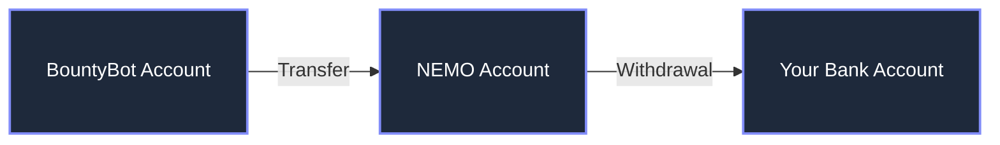

# New Money Company Integration

::: tip What is New Money Company?
New Money Company (NEMO) is BountyBot's payout processing partner, similar to Stripe Connect. When you receive a payout, funds are transferred to your NEMO account for withdrawal to your bank account.
:::

## How it Works

## Account Creation

When you receive your first payout on BountyBot, we automatically create a NEMO account for you using:
- Your provided given and family name
- Your email address associated with BountyBot

## Withdrawal Process

1. **Balance Transfer**: When you request a withdrawal, we transfer your funds from BountyBot to your NEMO account
2. **Identity Verification**: To withdraw funds to your bank account, you must complete NEMO's KYC process
3. **Bank Transfer**: Once verified, you can transfer funds from NEMO to your bank account

::: warning Important
BountyBot support cannot assist with NEMO's identity verification process. Please contact NEMO support directly for any KYC-related questions.
:::

## Supported Jurisdictions

NEMO supports withdrawals in numerous countries across multiple regions. Below is a comprehensive list of supported jurisdictions as of February 1, 2025.

::: details North America
- Barbados
- Canada
- Costa Rica
- Dominica
- Dominican Republic
- Guadeloupe
- Guatemala
- Honduras
- Jamaica
- Martinique
- Mexico
- Panama
- Puerto Rico
- Saint Lucia
- Trinidad & Tobago
- United States
:::

::: details South America
- Argentina
- Belize
- Brazil
- Chile
- Colombia
- Ecuador
- Peru
:::

::: details Europe
- Albania
- Andorra
- Armenia
- Austria
- Azerbaijan
- Belgium
- Bosnia and Herzegovina
- Bulgaria
- Croatia
- Cyprus
- Czech Republic
- Denmark
- Estonia
- Finland
- France
- Georgia
- Germany
- Ghana
- Gibraltar
- Greece
- Hungary
- Iceland
- Ireland
- Isle of Man
- Italy
- Jersey
- Kosovo
- Latvia
- Liechtenstein
- Lithuania
- Luxembourg
- Macedonia
- Malta
- Moldova
- Monaco
- Montenegro
- Netherlands
- Norway
- Poland
- Portugal
- Romania
- San Marino
- Serbia
- Slovakia
- Slovenia
- Spain
- Sweden
- Switzerland
- Ukraine*
- United Kingdom
:::

::: details Middle East & Africa
- Bahrain
- Benin
- Botswana
- Burkina Faso
- Comoros
- Djibouti
- Egypt
- Ethiopia
- Ghana
- Israel
- Jordan
- Kenya
- Kuwait
- Lebanon
- Lesotho
- Madagascar
- Mauritius
- Malawi
- Morocco
- Namibia
- Nigeria
- Oman
- Qatar
- Rwanda
- Saudi Arabia
- South Africa
- Tunisia
- Uganda
- United Arab Emirates (UAE)
- Zambia
- Zimbabwe
:::

::: details Asia
- Bangladesh
- Cambodia
- China
- Hong Kong
- India
- Indonesia
- Japan
- Kazakhstan
- Kyrgyzstan
- Malaysia
- Maldives
- Mongolia
- Nepal
- Pakistan
- Philippines
- Singapore
- South Korea
- Sri Lanka
- Tajikistan
- Thailand
- Tonga
- Turkey
- Vietnam
:::

::: details Oceania
- Australia
- Fiji
- French Polynesia
- Palau
- Mayotte
- New Caledonia
- New Zealand
- Reunion
- Wallis and Futuna Islands
:::

::: warning Ukraine Service Limitation
*Service to Ukraine is limited to areas controlled by the Ukrainian Government and requires manual review by the NEMO compliance team. Please contact NEMO Premier Support for assistance with onboarding and verification.
:::
