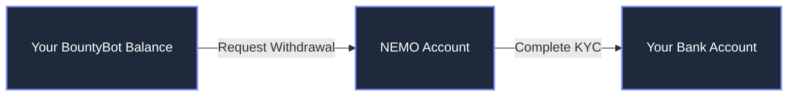

# Withdrawing Your Funds

::: warning Current Limitations
- **Withdrawal Fee**: 10% fee applies to all withdrawals
- **Maximum Amount**: $600 total limit (temporary until 1099 tax form support is implemented)
:::

## Overview

BountyBot uses [New Money Company (NEMO)](/guide/new-money-company) for processing all payouts. When you request a withdrawal, your funds will be transferred to your NEMO account, which you can then withdraw to your bank account.

## Eligibility Requirements

::: danger Important Notice
1. You must be located in a [supported jurisdiction](/guide/supported-regions#payout-availability-nemo)
2. Your country must not be subject to U.S. sanctions
3. You must complete NEMO's identity verification (KYC) process
:::

## Withdrawal Process

### 1. Request a Transfer

::: details Required Information
To initiate a transfer to your NEMO account, you'll need:
- Amount to withdraw (subject to the $600 limit)
- Your full legal name
- Email address associated with your BountyBot account
:::

### 2. NEMO Account Setup

::: tip First-time Setup
If this is your first withdrawal:
1. We'll automatically create a NEMO account for you
2. You'll receive an email from NEMO to complete verification
3. Follow NEMO's instructions to verify your identity
:::

### 3. Accessing Your Funds

Once your funds are transferred to NEMO:
1. Log in to your NEMO account
2. Complete identity verification (if not done already)
3. Link your bank account
4. Initiate withdrawal to your bank

::: warning Support Note
- BountyBot support can assist with the initial transfer to NEMO
- For NEMO-related issues (verification, bank transfers), please contact NEMO support directly
- Check [supported regions](/guide/supported-regions) for the most up-to-date payout availability
:::
