# Bounty Lifecycle

::: tip What happens to your bounty?
Follow the journey of a bounty from creation to completion, and understand how funds are distributed in different scenarios.
:::

## Flow Diagram

```mermaid
%%{init: {
  'flowchart': {
    'nodeSpacing': 100,
    'rankSpacing': 120,
    'curve': 'natural'
  }
} }%%
flowchart TD
    %% Define styles
    classDef decision fill:#1e1b4b,stroke:#818cf8,stroke-width:3px,font-size:18px,padding:25px,color:#ffffff
    classDef action fill:#1e293b,stroke:#818cf8,stroke-width:3px,font-size:18px,padding:25px,color:#ffffff
    classDef manual fill:#451a1a,stroke:#ef4444,stroke-width:3px,font-size:18px,padding:25px,color:#ffffff
    classDef auto fill:#064e3b,stroke:#10b981,stroke-width:3px,font-size:18px,padding:25px,color:#ffffff

    %% Nodes with emojis for better visual hierarchy
    A{"🔍 Issue<br/>Closed?"}
    A -->|Yes| B{"📝 Has PR<br/>Reference?"}
    A -->|No| C{"👥 Manual PR<br/>Review<br/>Requested?"}
    
    B -->|Yes| D{"🔄 Multiple<br/>PRs?"}
    B -->|No| E["⏳ Wait 14 days<br/>for claims"]
    
    D -->|Yes| F["👥 Manual Review<br/>Multiple PRs"]
    D -->|No| G["✨ Auto-distribute<br/>Funds"]
    
    C -->|Yes| H["👥 Manual Review<br/>PR"]
    
    E -->|After 14 days| L["💫 Return<br/>Credits"]
    E -->|Claim Made| M["👥 Manual Review<br/>Claim"]
    
    %% Apply styles
    class A,B,C,D decision
    class E action
    class F,H,M manual
    class G,L auto

    %% Add smooth edges
    linkStyle default stroke:#818cf8,stroke-width:2px,stroke-dasharray: 5 5
```

## Process Explanation

::: info Issue Closure
When an issue is closed, the system immediately begins the resolution process by checking for associated Pull Requests.
:::

### Decision Points

::: details PR Reference Check
- **Has PR**: System checks for multiple contributors
- **No PR**: Enters 14-day claim waiting period
:::

::: details Multiple PRs
- **Multiple PRs**: Requires manual review for fair distribution
- **Single PR**: Automatic distribution to PR author
:::

### Claims Period

::: warning Important
For issues without PR references, a 14-day window opens:
- Contributors can submit claims during this period
- Unclaimed bounties are returned after timeout
- All claims require manual review
:::

### Review Types

::: danger Manual Review Required
Manual review (highlighted in red) is needed when:
1. Multiple PRs exist
2. PR review is explicitly requested
3. Claims are made during waiting period
:::

::: tip Automatic Handling
Automatic processing (highlighted in green) occurs for:
- Single PR distribution
- Credit return after timeout
:::

::: warning Note
All manual reviews are conducted by our team to ensure fair distribution and prevent gaming of the system.
:::
