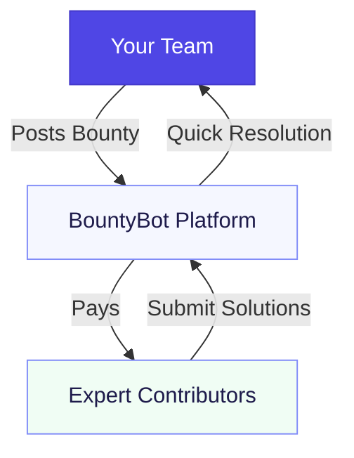

# Why Choose BountyBot?

::: tip 🚀 Supercharge Your Development Workflow
Transform how you handle dependency issues and feature requests. BountyBot connects you with experts who already know the codebase, delivering solutions faster and more efficiently.
:::

## The BountyBot Advantage

Efficiency is everything when you're on a deadline or juggling a packed roadmap. Imagine your team encounters a bug in a library or framework they depend on—but fixing it would require hours (or days) of reverse-engineering an unfamiliar codebase. That’s wasted time your engineers could spend building features or delivering on critical objectives.  

With **BountyBot**, you can bypass this inefficiency by funding contributors who already know the codebase. These developers can solve the problem quickly and effectively, saving your team time and ensuring the work gets done right.

## Real-World Scenarios  

### **Scenario 1: Your Engineer vs. an Existing Contributor**  

Your engineer is tasked with fixing a bug in a dependency. It’s a small issue, but understanding the codebase is no small feat. They’ll need to:  

- Read documentation (if it exists).  
- Navigate an unfamiliar architecture.  
- Debug without the full context of design decisions or existing constraints.  

Now, imagine an alternative: you post a bounty. A contributor who already works on the project sees it, claims it, and submits a fix in half the time it would take your engineer. Your team stays focused, the problem gets solved efficiently, and the contributor earns for their expertise.

### **Scenario 2: Unblocking Your Roadmap**  

You’re building a product, but a bug or missing feature in an open-source dependency is blocking your progress. One of your developers volunteers to tackle it, but they’ve never touched the codebase. What would take them a week could take an experienced contributor a day.  

Instead of letting the bottleneck drag your timeline, you offer a bounty. The issue gets fixed quickly by someone who knows the system inside and out. Your team stays on track, and you deliver on time.

### **Scenario 3: High-Impact Problems for Maintainers**  

You maintain an open-source library and frequently hear users request enhancements or report edge-case bugs. You’d love to address them, but your limited time means you can only tackle the highest priorities.  

With BountyBot, you can post bounties for the lower-priority tasks you can’t get to, knowing they’ll attract experienced contributors familiar with your project. This frees you up to focus on the work that matters most.

## Why Efficiency Matters  

### **The Hidden Cost of Learning From Scratch**  

When your engineer dives into an unfamiliar codebase, it’s not just the time spent learning—it’s the opportunity cost of what they could have been building instead. Multiply this inefficiency across a team, and it adds up fast.  

With BountyBot, you’re paying for expertise, not ramp-up time. An experienced contributor already understands the problem space, so they deliver high-quality work in less time.  

### **Accelerating Critical Fixes**  

Critical bugs and features can’t wait. By using BountyBot, you can offer immediate incentives for contributors who know the codebase to prioritize and resolve these issues. The result? Faster resolution, fewer delays, and less stress for your team.  

## How BountyBot Delivers Efficiency  

1. **Leverage Existing Knowledge**  
   Tap into the expertise of contributors who already understand the codebase, avoiding the overhead of training your team on unfamiliar systems.  

2. **Clear Expectations, Faster Results**  
   With bounties, you define the requirements upfront—no need for back-and-forth clarification. Contributors can deliver exactly what you need, quickly and efficiently.  

3. **Focus Your Team**  
   Keep your engineers focused on the work that drives your product forward, while contributors handle the dependencies and edge cases that would otherwise slow you down.  

## Get Started Today  

With BountyBot, you can eliminate inefficiency, unblock your team, and reward the experts who know how to get the job done.  

- **Maintainers**: Learn how to create your first bounty in our [Funding Your First Bounty](/guide/funding-first-bounty) guide.  
- **Contributors**: Explore bounties that match your skills in our [Getting Started Guide](/guide/getting-started).  

Stop wasting time reinventing the wheel. With **BountyBot**, you can solve problems faster and smarter. Try it now.
